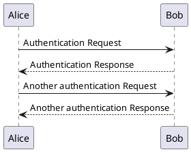

# gatsby-remark-plantuml #

Gatsby Remark plugin to transform [PlantUML][PlantUML] code blocks into SVG images.

## Install ##

```
npm install --save  gatsby-remark-plantuml
```

**Note:** `gatsby-transformer-remark` or `gatsby-plugin-mdx` must already be installed and configured in your gatsby installation.

### Prerequisites ###

This plugin bundles `plantuml-jar-mit-1.2020.15` but must have the other prerequisites for a local PlantUML v1.2020.15
[installation][plantuml--installation]:

* [Java][java]
* [Graphviz][graphviz] (this is not optional as the plugin can't tell if you
  plan to only create sequence or activity (beta) diagrams)

## How to use ##

### with gatsby-transformer-remark ###

```javascript
// In your gatsby-config.js
plugins: [
  {
    resolve: `gatsby-transformer-remark`,
    options: {
      plugins: [
        {
          // its order in the `gatsby-transformer-remark` plugins list is important.
          // * before `gatsby-remark-prismjs` so the code block has been transformed
          //   and `gatsby-remark-prismjs` will never see it as a code block
          // * after `gatsby-remark-code-titles` so the title block will be generated
          resolve: `gatsby-remark-plantuml`,
        },
      ],
    },
  },
]
```

### with gatsby-plugin-mdx ###

```javascript
// In your gatsby-config.js
    {
      resolve: `gatsby-plugin-mdx`,
      options: {
        gatsbyRemarkPlugins: [
          {
            // NOTE: As this plugin replaces the `plantuml` code blocks with an svg
            // its order in the `gatsby-transformer-remark` plugins list is important.
            // * before `gatsby-remark-prismjs` so the code block has been transformed
            //   and `gatsby-remark-prismjs` will never see it as a code block
            // * after `gatsby-remark-code-titles` so the title block will be generated
            resolve: `gatsby-remark-plantuml`,
          },
        ],
      },
    },

```

## Options

| Name       | Default     | Description |
| ---------- | ----------- | ----------- |
| `maxWidth` | `undefined` | The `maxWidth` value to apply to the `width` attribute of the generated svg.<br /><br />When `undefined` the svg will default to the plantuml width and height which is the entire diagram.<br /><br />Otherwise set the `width` attribute of the svg to the provided value, use any valid values include `vh` and `%`s. Additionally sets the `height` attribute of the svg to `auto` to ensure the svg sizes correctly |
| `attributes` | `undefined` | String of custom attributes that will be added to the generated svg element. See [Custom Attributes](#custom-attributes) |
| `plantumljar` | use embedded jar | Path to an alternative PlantUML Jar file |
|`JAVA_OPTS` | [] | Additional options to pass to java executable.<br/><br/>Will always include `DEFAULT_JAVA_OPTS = ["-Djava.awt.headless=true"]`
|`PLANTUML_OPTS` | [] | Additional options to pass as options to plantuml.<br/><br/>**WARNING** use at own risk. Passing an incompatible option will cause this plugin to stop working and probably with no reasonable error messages generated.<br/><br/>Will always include  `DEFAULT_PLANTUML_OPTS=["-charset", "UTF-8", "-Dfile.encoding=utf8", "-pipe", "-pipeNoStderr", "-tsvg"]`

You can specify these options in your `gatsby-config.js` file as follows:

```javascript
// In your gatsby-config.js
plugins: [
  {
    resolve: `gatsby-transformer-remark`,
    // or resolve: `gatsby-plugin-mdx`,
    options: {
      plugins: [
        {
            resolve: 'gatsby-remark-plantuml',
            options: {
              maxWidth: '960',
              attributes: 'max-width: 960;',
              plantumljar: '/path/to/plantuml.jar'
            }
        },
      ],
    },
  },
]
```

### Usage in Markdown ###

See [PlantUML][plantuml] and select any of the diagram types from the top
navigation bar for examples of how to write PlantUML diagrams.

Then in a code block specify the language type of `plantuml` and in the code
block write your PlantUML diagram.

For example:

````

````

### Custom Attributes ###

By default, the following inline style is applied to all rendered SVGs in order to make them responsive:

```css
max-width: 100%;
height: auto;
```

This can be overwritten by using the custom attributes feature:

````

````

[graphviz]: http://plantuml.com/graphviz-dot
[java]: https://www.java.com/en/download/
[plantuml--installation]: http://plantuml.com/starting
[plantuml]: http://plantuml.com/
